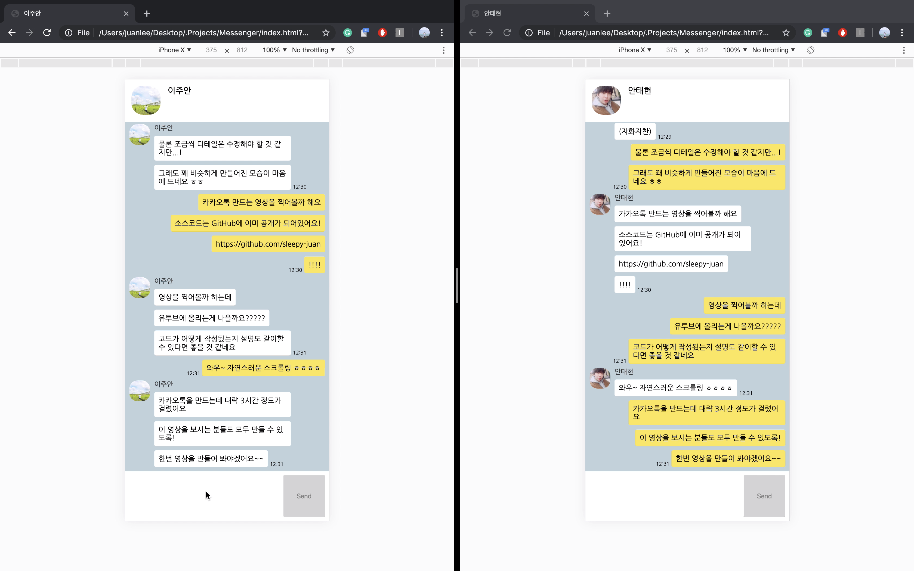

# 카카오톡 클론코딩

익숙한 메신져앱인 카카오톡을 웹으로 클론 코딩해 보았어요.



## 만들어본 기능

1. 기본적인 카카오톡 레이아웃! 상단 프로필, 메시지, 하단 인터페이스 등
2. 크기 변경시 메시지 박스만 크기가 바뀌고, 가로로 움직여도 Send 버튼은 정사각형 유지!
3. 메시지 전송 기능
4. 상대방 표시 및 보낸 시간 표시 기능!
5. 자연스러운 메시지 리스트 (스크롤 포함!)
6. 기타 카톡스러운 디자인~

## 사용한 기술 및 라이브러리 및 기타 등등

1. HTML
2. CSS
3. Javascript
4. jQuery
5. Google Fonts
6. Firebase (real-time database)

### 레이아웃 비율

iPhone X 를 기준으로 만들었어요!

### 데이터베이스 구조

```
/
├── profiles/
    ├── 사용자이름: 이미지 URL
    ├── ...
    └── 사용자이름: 이미지 URL
└── messages/
    ├── {메시지 ID}/
        ├── me: 보낸사람 이름
        ├── other: 받는사람 이름
        ├── msg: 메시지 내용
        └── timestamp: 보낸시각
    ├── ...
    └── {메시지 ID}/
```

## 어떻게 실행시키나요?

1. Firebase real-time database를 만들어주세요!
2. Credential을 `chat.html` 에 복사해주세요.
3. `index.html` 실행!
